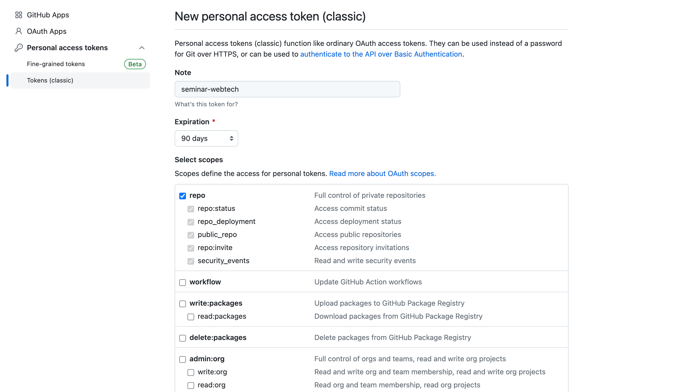
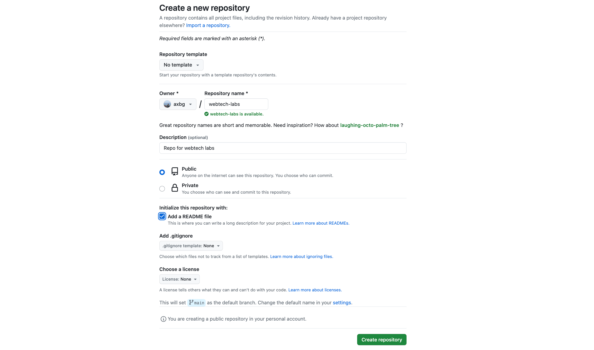

# Intro: Git & JavaScript

## Table of contents
1. [GitHub](#1-github)
    1. [Creating a GitHub account](#11-creating-a-github-account)
    2. [Creating a repository](#12-creating-a-repository)
    3. [Installing git](#13-installing-git)
    4. [Cloning a repository](#14-cloning-a-repository)
    5. [Code versioning](#15-code-versioning)

2. [JavaScript](#2-javascript)
    1. [Client-side JavaScript](#21-client-side-javascript)
    2. [Server-side JavaScript](#22-server-side-javascript)

## 1. GitHub
- Git, the software that powers GitHub and any other similar platform, is a tool created in 2005 by Linus Torvalds that helps programmers to version their code and collaborate

- Git has a specific terminology, the most important subjects being:
    - Repository - a directory containing all the files within a project and all their previous versions

    - Commit - a snapshot of changes that occurred for each file of the project
        - each commit is described by a message that sums up the effect of the changes
        - each commit is atomic and represents the main memory block of Git

    - Staged - a state associated with all the files that will be included in the upcoming commit (also known as *staging area*)

    - Branch - a separate timeline that diverges from the main branch and can contain new files or different versions of already existing files
        - the **main** branch represents the default state of the repository
        - secondary branches can be integrated back into the main branch through *merging*
 
    
    - Clone - a copy of a repository

    - Remote - a copy of a repository available on a remote server that is generally treated as the *main* source of truth

    - Pull - an action that updates a local copy of a repository by *pulling* the new commits from the *remote* repository
    
    - Push - an action that updates the *remote* repository with new commits that are created in the local version of the repository

    - Conflict - a blocking state that happens when the same sections of the same files are modified by 2 different commits *at the same time*

    - Merge - an action that allows the changes from a branch to be integrated into another branch

- To apply these concepts, git defines a series of commands, the most important being:
    - git clone - clones a repository

    - git config - updates the configurations of the local git program
    
    - git branch - prints all the branches in a repository
    
    - git checkout - switches the active branch
        - accepts the "-b" parameter to create a new branch and switch to it
    
    - git fetch - downloads the metadata describing the latest changes that happened on the remote repository
    
    - git pull - downloads the latest changes from the remote repository and updates the local repository
    
    - git add - adds files into the *staging area*
        - the files present in the staging area will be included in the next commit
    
    - git status - displays the status of the files, including which ones are present in the *staging area* 
    
    - git commit - creates a new commit that includes all the files added in the staging area
        - commonly used with the "-m" parameter that allows the commit author to write the commit message
    
    - git push - pushes the new local commits into the remote repository

    - git log - prints the commit history of the active branch

- Git is a very complex and powerful tool that has become a requirement for any programmer working in a larger team, thus, having a profound understanding of the inner concepts is a must
    - Recommendation: detailed tutorial with illustrations: https://www.atlassian.com/git/tutorials/what-is-version-control
    - Recommendation: cheat sheet with the most important commands: https://www.atlassian.com/git/tutorials/atlassian-git-cheatsheet

### 1.1. Creating a [GitHub](https://github.com) account
- First off, we are going to create an account on GitHub that will be used throughout the semester for:
    - Lab exercises
    - Homework
    - Projects
    - (basically anything involving code 😇)

- We are going to generate a token that will allow us to connect to GitHub from our local machine, to download our private repositories, and update existing projects
    - access: https://github.com/settings/tokens
    - click on "Generate New Token"
    - click on "Generate New Token (classic)"
    - give a  name to the new token
    - select "Expiration 90 days"
    - check "repo"
 
    - after creation, copy the generated token
        - after this step, the token will not be available in GitHub anymore, so pay attention to store it in a safe location (for now)
        - don't worry if you lose it, we can always generate a new one, but when doing that, always remember to remove the tokens that you are not using anymore

### 1.2. Creating a repository
- Access https://github.com/new to create a new repository
- Fill in the fields:
    - Repository name
    - Description
    - Check "Public"
    - Check "Add a README file"
 
- Click "Create repository"

### 1.3. Installing Git
- Access https://git-scm.com/downloads and download the version specific to your operating system

### 1.4. Cloning a repository
- After we finish the installation, we will open a terminal instance and execute the *clone* command
 ```bash
    git clone https://github.com/<<username>>/<<repo>>.git
    # replace the values between << >> with your values
    # e.g.: git clone https://github.com/axbg/webtech.git
 ```
- Replace the username with your own username, and use the previously generated token as a password

### 1.5. Code versioning
- Access the file "README.md" from the local clone of the repository and add a new line (you can write whatever you want)

- Applying the concepts that we discussed in the beginning, we will stage the changes, create a commit, and upload it to the remote repository
 ```bash
    git add .
    git status
    git commit -m "Update README.md"
    git log
    git push
 ```

- Refresh the repository page in your browser, and we should be able to see the changes here as well: **congrats, you've just created your first git commit!**

## 2. JavaScript
- Although JavaScript is a language well-known for its association with front-end development, during this semester, we will be using JavaScript to write both front-end and back-end apps

- In a web application, the front-end represents everything that the users can see on their devices (graphical interface), while the back-end defines all the logical processes that implement various functionalities on the server


### 2.1 Client-side JavaScript
- All browsers are shipped with a JavaScript runtime that executes code on client devices

- This JavaScript code, although downloaded, in the beginning, from the server, will actually be executed on the client device

- The fastest way to execute JavaScript code is to use the development console of a browser

- Similarly, we can create an HTML file and include a <script></script> section inside which we could write JavaScript code that will be executed when the browser opens the HTML file

### 2.2 Server-side JavaScript
- Besides browsers, JavaScript can be executed on the servers as well, using a runtime published in 2009 called **Node.js**
    - To use Node.js we should first install it: https://nodejs.org/en/download 

- Create a file named "main.js" and add the following line:
 ```js
    console.log("hello node");
 ```

- Open a terminal, access the directory where you created the "main.js" file, and execute the command:
 ```bash
    node main.js
 ```

- Node.js is the backbone of back-end applications written in JavaScript and it includes a lot of useful features out-of-the-box

- Replace the previous line in the "main.js" file with:
 ```js
    const http = require("http");

    http
     .createServer((req, res) => {
                res.write("Hello web!");
                res.end();
     }).listen(8080);
 ```

- After executing the program again, access http://localhost:8080 in your browser, where we should be able to see the message "Hello web!"

- **Congrats, you've just created your first web application**
